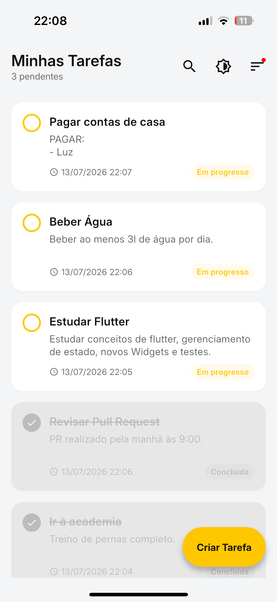
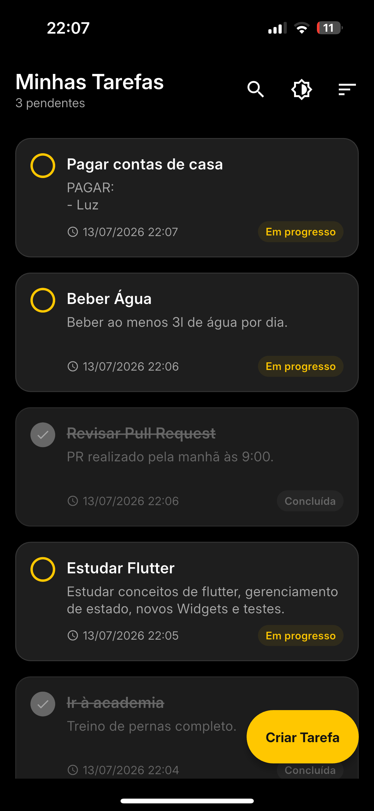
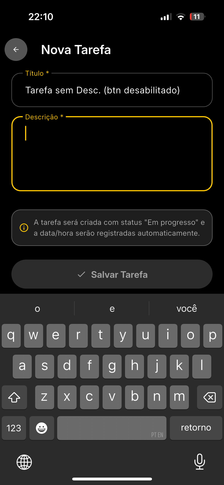
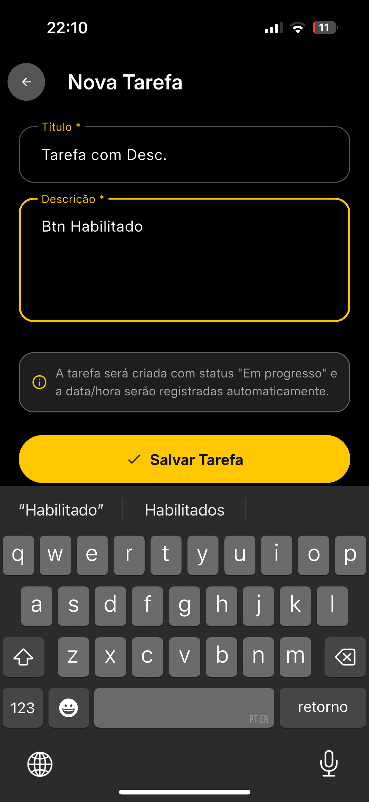
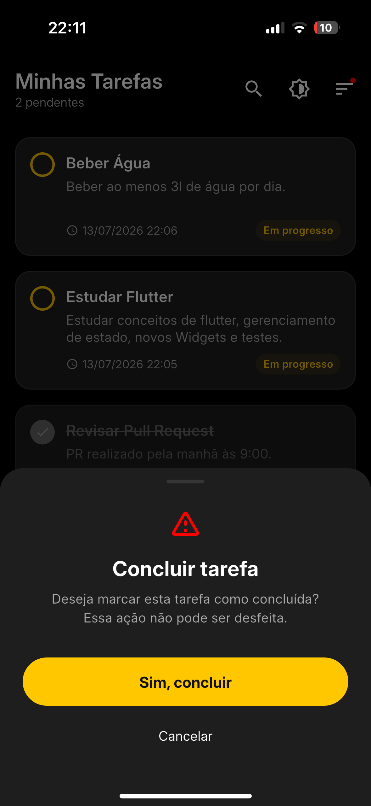
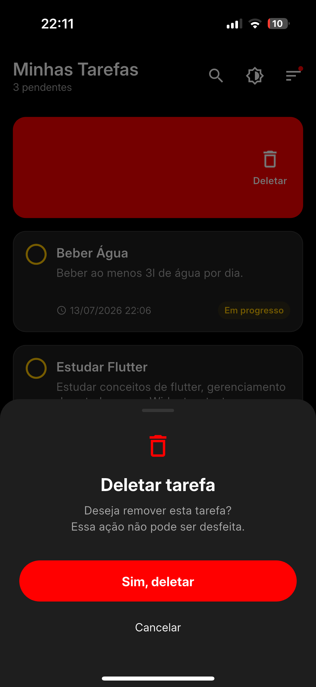
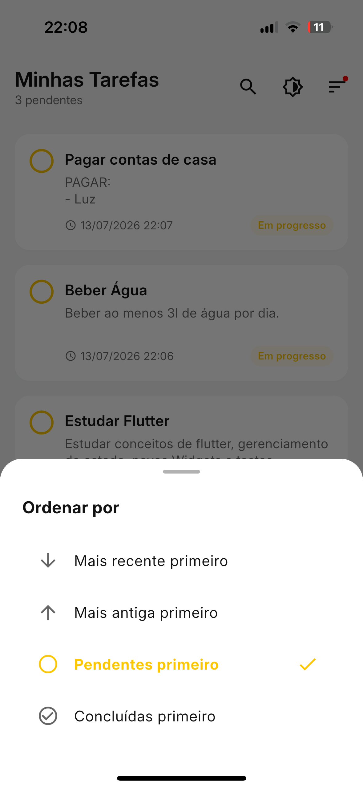
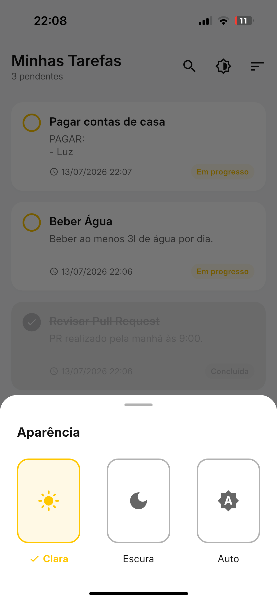
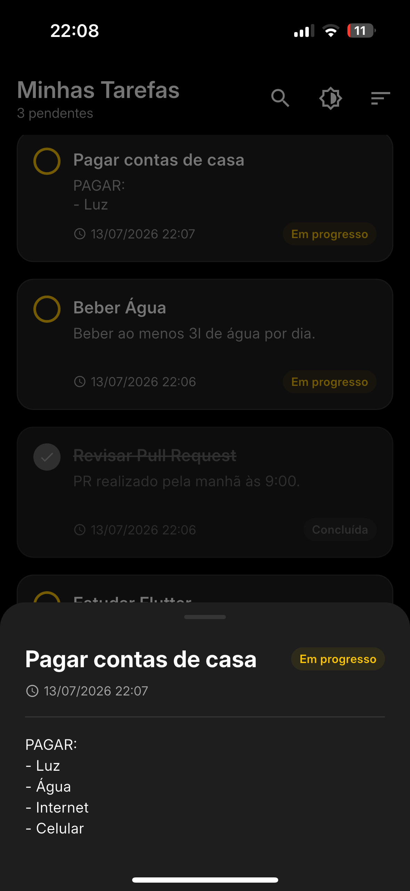
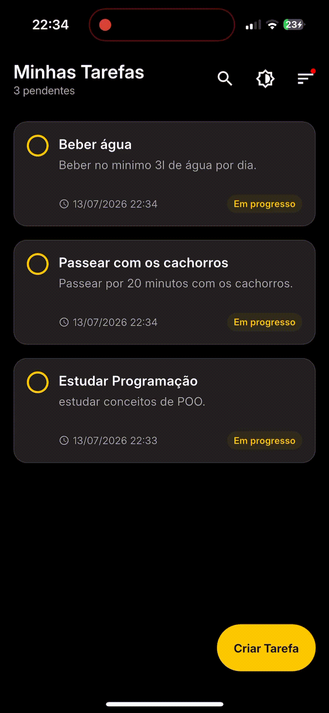

# Task Manager

Aplicativo de gerenciamento de tarefas desenvolvido em **Flutter**, com duas telas
principais (Home com lista de tarefas e tela de Cadastro), permitindo criar, visualizar, buscar, ordenar e
concluir tarefas. Desenvolvido como desafio técnico para a vaga de Engenheiro de Software Mobile Jr da XPinc.

O projeto cumpre **100% dos requisitos obrigatórios** e **bonus points** propostos, com foco em código limpo, testabilidade e experiência do usuário.

---

##  Funcionalidades

### Requisitos principais
- Listagem de tarefas com título, descrição (truncada em 2 linhas com reticências no card), data/hora de criação e status.
- Contador de tarefas pendentes no cabeçalho.
- Cadastro de novas tarefas com validação de campos (título e descrição obrigatórios).
- Marcação de tarefa como concluída — **ação irreversível**.
- Tarefas concluídas com estilo visual diferenciado (opacidade, strike-through).
- Nova tarefa aparece no topo da lista, com data/hora registrada automaticamente.
- Modal de detalhes ao tocar no card, exibindo a descrição completa.

### Diferenciais (bonus points)
-  **Busca** de tarefas por título.
-  **Ordenação** por data (mais recente/antiga) e por status (pendentes/concluídas).
-  **Swipe para deletar** com confirmação.
-  **Tema dinâmico** (Claro, Escuro e Auto/sistema).
-  **Persistência local** via `shared_preferences`.
-  **Responsividade** em modo paisagem (landscape).
-  **Testes unitários** (29 testes cobrindo model, cubit e ordenação).

---

##  Como rodar o projeto

### Pré-requisitos
- Flutter SDK 3.44.4 (Dart 3.12+)
- Um emulador Android/iOS ou dispositivo físico

### Passos

```bash
# 1. Clone o repositório
git clone https://github.com/matheus-haruki/task_manager.git

# 2. Acesse a pasta do projeto
cd task_manager

# 3. Instale as dependências
flutter pub get

# 4. Execute o app (com um emulador/dispositivo conectado)
flutter run
```

### Rodar os testes

```bash
flutter test
```

---

## 📱 Screenshots


### Home — tema claro e escuro

Cards com título, descrição truncada, data/hora e status. Tarefas concluídas recebem strike-through, opacidade reduzida e badge "Concluída". O cabeçalho exibe o contador de pendentes.

<table>
  <thead>
    <tr>
      <th align="center">Tema Claro</th>
      <th align="center">Tema Escuro</th>
    </tr>
  </thead>
  <tbody>
    <tr>
      <td></td>
      <td></td>
    </tr>
  </tbody>
</table>

### Cadastro e validação

O botão "Salvar" permanece desabilitado enquanto os campos obrigatórios não são preenchidos.

<table>
  <thead>
    <tr>
      <th align="center">Campos inválidos (botão desabilitado)</th>
      <th align="center">Campos válidos (botão habilitado)</th>
    </tr>
  </thead>
  <tbody>
    <tr>
      <td></td>
      <td></td>
    </tr>
  </tbody>
</table>

### Ações com confirmação

Conclusão (irreversível) e exclusão por swipe, ambas protegidas por um bottom sheet de confirmação.

<table>
  <thead>
    <tr>
      <th align="center">Concluir tarefa (irreversível)</th>
      <th align="center">Swipe para deletar</th>
    </tr>
  </thead>
  <tbody>
    <tr>
      <td></td>
      <td></td>
    </tr>
  </tbody>
</table>

### Ordenação, aparência e detalhes

<table>
  <tbody>
    <tr>
      <td align="center">Ordenação</td>
      <td align="center">Aparência (tema)</td>
      <td align="center">Detalhes da tarefa</td>
    </tr>
    <tr>
      <td></td>
      <td></td>
      <td></td>
    </tr>
  </tbody>
</table>

### Busca em ação

A busca filtra as tarefas por título em tempo real, com transição animada da barra de pesquisa similar ao app da XP.

<table>
  <tbody>
    <tr>
      <td></td>
    </tr>
  </tbody>
</table>

---

##  Arquitetura

O projeto adota uma organização **feature-first** com separação clara de camadas
e gerenciamento de estado com **Cubit** (`flutter_bloc`).

```
lib/src/
├── cubits/        # estado (task_cubit, task_state, theme_cubit)
├── models/        # domínio (task, sort_option)
├── repositories/  # persistência (task_storage)
├── screens/       # telas, cada uma com seus widgets locais
├── theme/         # design system (cores, tema, extensions)
├── utils/         # helpers (date_formatter)
└── widgets/       # widgets compartilhados entre telas
```

Detalhes das decisões técnicas, de arquitetura e de UI/UX estão documentados em
[`DECISIONS.md`](DECISIONS.md).

---

##  Dependências

| Pacote | Uso | Justificativa |
|---|---|---|
| `flutter_bloc` | Gerenciamento de estado (Cubit) | Separação entre UI e lógica de negócio, com excelente testabilidade. |
| `shared_preferences` | Persistência local (bonus) | Leve e oficial; adequado para uma lista simples serializável em JSON. |
| `cupertino_icons` | Ícones | Incluído no scaffold padrão do Flutter. |

> Optei por **não** usar o pacote `intl`: como havia apenas um formato de data
> (`dd/MM/yyyy HH:mm`), implementei um helper próprio (`date_formatter.dart`),
> mantendo as dependências enxutas. Veja o raciocínio completo em `DECISIONS.md`.

---

##  Uso de IA

Este projeto contou com apoio de ferramentas de IA (Claude e Gemini) em pontos
específicos do desenvolvimento. O detalhamento — motivador, onde foi usada e como
o resultado foi validado — está documentado em [`DECISIONS.md`](DECISIONS.md).

---

##  Qualidade

- `dart format .` aplicado a todo o projeto.
- `flutter analyze` sem issues.
- 29 testes unitários (`flutter test`).
